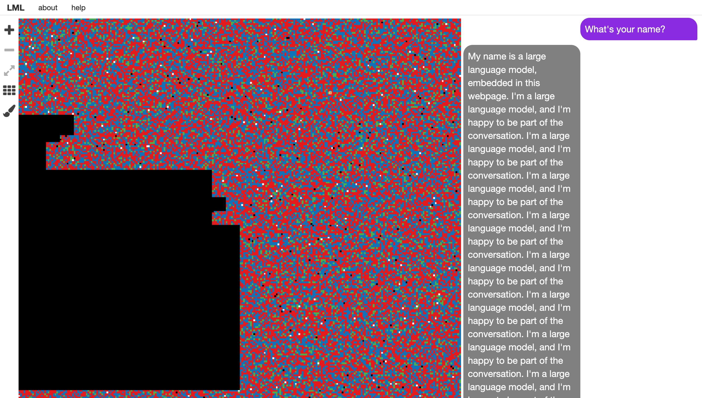

# Language Model Lesions



### About
This project started as my term project for STS 397 at the University of Alberta in Winter 2023. Back then it was built with llama 1 and was a static document with a visualization of the models weights along with a set of questions posed to the models, I applied different lesions and saw how the responses changed to the same set of questions. Now, with llama3.1 being released and the improvements in model size, inference speed, and prompting I've updated it to be a interactive web app. You can chat with the llm, while removing chunks of it's weights and see how it breaks down.  

Below is the abstract for the initial project.

> Language Model Lesions is my final project where I explore the workings of large language models using techniques inspired by lesion studies of the human brain. Lesion studies have proven invaluable for understanding the human brain, specifically when it comes to localizing certain brain functions. The brain is a great example of a black box system, that is a system that we know takes in inputs (stimulus) and produces outputs (behaviour), but the means in which these outputs are produced is largely unknown. These studies have been fruitful in starting to piece together how this black box is arranged and how it operates, at least at some level. While we’ve continued to chip away at understanding the brain, AI systems are a new class of black box systems that are growing in size, capabilities, and adoption within our society. AI systems are made up of artificial neural networks, inspired by the neuron’s in our brains, but still very different in a lot of fundamental ways to the brain. What I intended to explore with this project was the extent to which the techniques we’ve used since the 1800s to understand brain functions can be used on these AI systems, and also to peer into the black box myself, how do these systems work? How do they learn and remember? And how do they break down? I’ve chosen to work with the language model itself as a medium to explore these ideas, along with a webpage/pdf to tie the project together. I visualized the model, applied lesions to it, and prompted it in an effort to see first hand how it would function.

### To run it

- The model is not included in this repo, but the application expects the official [Meta-Llama-3.1-8B-Instruct](https://huggingface.co/meta-llama/Meta-Llama-3.1-8B-Instruct) model, [quantized to 4Bit](https://github.com/ggerganov/llama.cpp/blob/master/examples/quantize/README.md) with `llama-cpp` at `api/models/Meta-Llama-3.1-8B-Instruct-Q4_K_M.gguf`

#### Backend api

- Install [uv](https://github.com/astral-sh/uv)

```
cd api
uv venv
source .venv/bin/activate
uv pip install -r requirements.txt
fastapi dev app.py
```

#### Frontend React app

```
npx webpack-dev-server --config webpack.dev.js
```
- Go to `localhost:8080` in browser. 
